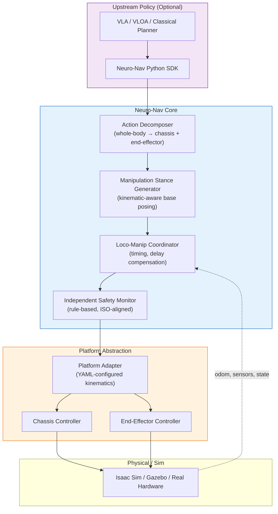

# Neuro-Nav

<div align="center">

<h3>The Whole-Body Integration Layer for Wheeled Industrial Platforms</h3>

<p>
    <b>Bridging Vision-Language-Action models and industrial mobile manipulators.</b><br>
    Loco-manipulation coordination, safety-aware execution, cross-platform adaptation.
</p>

[](https://docs.ros.org/)
[](https://developer.nvidia.com/isaac-sim)
[](https://www.python.org/)
[](https://opensource.org/licenses/Apache-2.0)

</div>

---

## What Neuro-Nav Is

Neuro-Nav is an open-source integration layer that connects **Vision-Language-Action (VLA) models** to **wheeled industrial platforms** — forklifts, AGVs, AMRs, and wheeled mobile manipulators.

It solves three problems that upstream VLA models do not solve, and that downstream chassis controllers cannot solve alone:

1. **Loco-Manipulation Coordination on Weakly-Coupled Platforms** — coordinating chassis motion and end-effector action without imposing humanoid-style whole-body policies, which are physically unnecessary and computationally wasteful for wheeled bodies.
2. **Safety-Aware Execution** — independently validating every VLA-generated action against industrial safety standards (ISO 3691-4 for forklifts, ISO 10218 for collaborative robots), maintaining the dual-track architecture required for functional safety certification.
3. **Cross-Platform Adaptation** — abstracting the action interface so a single upstream policy can drive different chassis types (Ackermann, differential, omnidirectional) and different end-effectors (forks, arms, grippers) without per-platform retraining.

## Why Not Just Use Humanoid Whole-Body Policies?

2026 has seen rapid progress in unified whole-body loco-manipulation policies — WholeBodyVLA (ICLR 2026), ULTRA, Ψ₀, and others. These models work because humanoid bipeds have **strong dynamic coupling**: any upper-body action shifts the ZMP, so locomotion and manipulation must be jointly optimized.

**Wheeled industrial platforms do not have this property.** A forklift's support polygon is ~10⁴× larger than a humanoid's; lifting a 1-ton pallet has negligible effect on chassis stability. For these bodies:

- **Unified policies are not physically necessary** — serial loco-then-manip pipelines remain near-optimal.
- **Unified policies are not commercially viable** — training data for industrial wheeled bodies is two orders of magnitude scarcer than humanoid data.
- **Unified policies cannot pass functional safety certification** — ISO 3691-4 requires an independent safety monitor, which a monolithic neural policy structurally violates.

Neuro-Nav targets the gap left by both worlds: **the weakly-coupled coordination problems that are real on industrial wheeled platforms but unaddressed by humanoid whole-body research.**

## Real-World Validation

The design choices in Neuro-Nav are validated against deployed industrial workloads:

| Task                              | Baseline            | Neuro-Nav Approach                        | Improvement |
| --------------------------------- | ------------------- | ----------------------------------------- | ----------- |
| Forklift pallet docking precision | ±5 cm (typical AGV) | ±1 cm (S0–S5 staged docking)              | 5×          |
| Pallet pickup cycle time          | ~90 s (3–5 stops)   | ~20 s (1 stop, in-motion fork engagement) | 4.5×        |
| RPP path oscillation              | Snake-like wobble   | Phase-corrected feedforward               | Eliminated  |

These come from real forklift deployment work — not simulation benchmarks.

## Core Concepts

### 1. Weakly-Coupled Loco-Manipulation

Instead of training an end-to-end whole-body policy, Neuro-Nav decomposes any upstream action into:
- **Chassis sub-action** (linear velocity, angular velocity)
- **End-effector sub-action** (fork lift/tilt/extend, or arm joint commands)

Each sub-action is verified and executed through its own control loop, with **explicit cross-system coordination** for cases where timing matters (e.g., hydraulic delay compensation during simultaneous chassis motion and fork lifting).

This is faster, safer, and more debuggable than a monolithic policy — at the small cost of giving up the strong-coupling benefits that wheeled bodies don't need anyway.

### 2. Manipulation-Aware Stance Generation

Traditional navigation stops at "close enough." Neuro-Nav computes the **optimal base pose** such that the end-effector workspace fully covers the target — given the actual kinematics of the platform, the geometry of the target object, and the constraints of the environment (aisle width, obstacles, dock clearance).

This is the wheeled-platform analog of "manipulation-aware locomotion" — but solved through explicit kinematic reasoning rather than RL, because wheeled platforms admit closed-form solutions that humanoids don't.

### 3. Independent Safety Monitor

Every action — whether from a VLA upstream, a classical planner, or a teleoperator — passes through an independent safety validator before reaching the actuators. The validator runs on rule-based logic (geometric, kinematic, and platform-specific), structurally isolated from the upstream model. This preserves the audit path required by ISO 3691-4 and similar standards.

### 4. Cross-Platform Abstraction

A single Neuro-Nav action interface drives multiple chassis types and end-effectors. Platform-specific kinematics, dynamics, and safety constraints are configured declaratively, not coded per project. Adding a new forklift model takes a YAML file, not a fork.

## Architecture



## Usage Example

```python
from neuro_nav import IndustrialAgent

# Initialize for a specific platform (forklift, AGV, or mobile manipulator)
agent = IndustrialAgent(platform="forklift_2ton", safety_profile="ISO_3691-4")

# High-level intent — Neuro-Nav handles stance, approach, and engagement
agent.execute(
    intent="pickup_pallet",
    target_id="pallet_007",
    precision="docking"  # triggers S0–S5 staged docking sequence
)

# Or accept a raw whole-body action from an upstream VLA
action = vla_model.predict(observation)  # shape: (chassis_dim + ee_dim)
agent.execute_action(action, validate=True)  # decomposes, validates, executes
```

## Project Structure

```plaintext
neuro-nav/
├── neuro_nav_sdk/           # Python SDK — high-level intent API + raw action API
├── neuro_nav_core/          # Decomposer, stance generator, coordinator, safety monitor
├── neuro_nav_platforms/     # Platform adapters (forklifts, AGVs, mobile manipulators)
│   ├── configs/             #   Declarative kinematic + safety configs (YAML)
│   └── controllers/         #   Per-platform control loop implementations
├── neuro_nav_sim/           # Isaac Sim & Gazebo integration
├── neuro_nav_safety/        # Rule-based validators (geometric, kinematic, platform-specific)
└── examples/                # End-to-end demos
```

## Roadmap

### Phase 1: Forklift Reference Implementation (Current)
- [x] Repo initialization, architecture design
- [ ] S0–S5 staged docking sequence (open-source reference)
- [ ] Forklift platform adapter with declarative YAML config
- [ ] Isaac Sim forklift environment with pallet scene
- [ ] Independent safety monitor for ISO 3691-4 critical rules

### Phase 2: Upstream Integration
- [ ] Action decomposer supporting VLA / VLOA / classical planner inputs
- [ ] Python SDK with `IndustrialAgent` interface
- [ ] Reference integration with one open-source VLA (π0 or OpenVLA)
- [ ] Manipulation-aware stance generator with kinematic reasoning

### Phase 3: Cross-Platform Generalization
- [ ] Second platform adapter (differential-drive AMR or mobile manipulator)
- [ ] Loco-manip coordinator with hydraulic / electric delay models
- [ ] Cross-platform validation suite
- [ ] Performance benchmarks against baseline ROS 2 Nav2 + MoveIt stack

### Phase 4: Production Hardening
- [ ] CAN bus data collection pipeline (passive expert demonstration capture)
- [ ] Safety certification documentation templates
- [ ] Deployment guides for real industrial environments

## Who This Is For

**You should use Neuro-Nav if:**
- You build VLA/VLOA models and want to validate them on wheeled industrial bodies without reinventing the integration layer.
- You operate wheeled industrial robots and want a maintainable path to integrate AI models without abandoning your safety certifications.
- You research loco-manipulation coordination on weakly-coupled platforms.

**You should look elsewhere if:**
- You work on humanoid bipeds → see WholeBodyVLA, ULTRA, Ψ₀.
- You need a general-purpose ROS 2 navigation stack → use Nav2 directly.
- You need a high-DOF arm manipulation framework → use MoveIt or your VLA's native runtime.

## Contributing

Neuro-Nav is built for and by people who work on real industrial robots. If you have deployment experience with forklifts, AMRs, or wheeled mobile manipulators — your input on platform configs, safety rules, and edge cases is the most valuable contribution you can make.

For technical contributors: ROS 2, Isaac Sim, kinematic modeling, and functional safety standards are the core skill areas.

## License

Apache 2.0