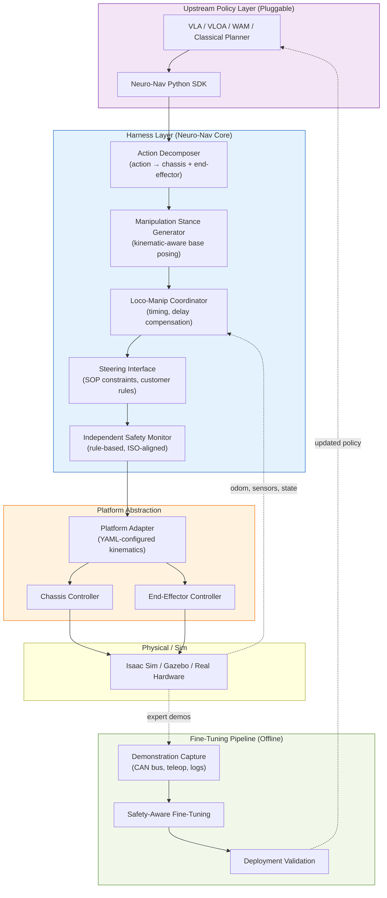

# Neuro-Nav

<div align="center">

<h3>An Industrial Harness Layer for Wheeled Mobile Manipulators</h3>

<p>
    <b>Between foundation models and physical reality.</b><br>
    Loco-manipulation coordination, safety-aware execution, cross-platform adaptation.
</p>

<p><i>
"Robotics is not just a model problem — it is a system problem."<br>
— Felix Yanwei, Generalist AI (on GEN-1, 2026)
</i></p>

[](https://docs.ros.org/)
[](https://developer.nvidia.com/isaac-sim)
[](https://www.python.org/)
[](https://opensource.org/licenses/Apache-2.0)

</div>

---

## What Neuro-Nav Is

Neuro-Nav is an open-source **Harness Layer** that connects foundation models — VLA, VLOA, World Action Models (WAM) — to **wheeled industrial platforms** such as forklifts, AGVs, AMRs, and wheeled mobile manipulators.

The term *Harness Layer* was introduced by Generalist AI to describe the engineering layer sitting **above** a foundation model and **below** the physical hardware — the layer that turns model intelligence into reliable, safe, certifiable physical behavior. Generalist AI is building this layer for dexterous tabletop manipulation. **Neuro-Nav is building it for industrial wheeled platforms.**

A foundation model alone cannot drive an industrial robot. Between the model's output and the actuator, you need:

1. **Loco-Manipulation Coordination** — coordinate chassis motion and end-effector action without imposing humanoid-style whole-body policies, which are physically unnecessary and computationally wasteful for wheeled bodies.
2. **Safety-Aware Execution** — independently validate every model-generated action against industrial safety standards (ISO 3691-4 for forklifts, ISO 10218 for collaborative robots), maintaining the dual-track architecture required for functional safety certification.
3. **Cross-Platform Adaptation** — abstract the action interface so a single upstream policy can drive different chassis types (Ackermann, differential, omnidirectional) and different end-effectors (forks, arms, grippers) without per-platform retraining.
4. **Fine-Tuning & Steering Support** — let foundation models be fine-tuned on customer-specific scenarios with safety guarantees, and let customer SOPs steer model behavior at inference time without retraining.

This is the work the foundation model itself does not do — and cannot do, because of certification, latency, and platform-specific constraints. Neuro-Nav is the layer that makes foundation models deployable on real industrial robots.

## Why Not Just Use the Latest Foundation Models?

2026 has seen rapid progress in robotic foundation models — unified whole-body policies (WholeBodyVLA, ULTRA, Ψ₀), object-centric VLOA architectures (RoboScience), and World Action Models (NVIDIA DreamZero, GR00T N2). It is tempting to assume these models, once mature, will replace integration layers like Neuro-Nav.

We believe this assumption is wrong, for the same reason Generalist AI built a Harness Layer on top of GEN-1: **model quality alone does not produce industrial-grade behavior**. As Yanwei from Generalist AI puts it, "A first-class model paired with a first-class system will always far outperform a first-class model paired with a weak system."

For wheeled industrial platforms specifically, three additional constraints limit the direct applicability of frontier models:

**Unified whole-body policies target strongly-coupled bodies.** Humanoid bipeds have small support polygons (~10² cm²); any upper-body action shifts the ZMP, making joint loco-manipulation optimization a physical necessity. Wheeled industrial platforms have support polygons four orders of magnitude larger; chassis stability is essentially decoupled from end-effector action. Unified policies on wheeled bodies are neither physically necessary nor commercially viable to train.

**World Action Models are not yet industrially deployable.** DreamZero demonstrates 2× generalization over SOTA VLAs, but its 14B-parameter diffusion backbone requires GB200-class hardware for 7Hz closed-loop control. Industrial edge controllers (Orin NX class) cannot run WAM inference directly. WAM's known weakness on sub-centimeter precision tasks also conflicts with industrial requirements like ±1cm pallet docking.

**No foundation model can be certified.** ISO 3691-4 and similar functional safety standards require an independent safety monitor architecturally isolated from the control system. A monolithic neural policy structurally violates this. Industrial deployments will continue to require dual-track architectures: model + independent validator. The validator is the Harness Layer's irreducible core.

**Neuro-Nav is upstream-neutral.** Whether you feed it VLA, VLOA, WAM, or a classical planner, the Harness Layer's job is the same: decompose the action, coordinate sub-systems, validate against safety rules, and execute on the platform. As foundation models evolve, Neuro-Nav evolves with them — without rewriting the integration stack each time.

## Real-World Validation

The design choices in Neuro-Nav are validated against deployed industrial workloads, not simulation benchmarks:

| Task                              | Baseline            | Neuro-Nav Approach                        | Improvement |
| --------------------------------- | ------------------- | ----------------------------------------- | ----------- |
| Forklift pallet docking precision | ±5 cm (typical AGV) | ±1 cm (S0–S5 staged docking)              | 5×          |
| Pallet pickup cycle time          | ~90 s (3–5 stops)   | ~20 s (1 stop, in-motion fork engagement) | 4.5×        |
| RPP path oscillation              | Snake-like wobble   | Phase-corrected feedforward               | Eliminated  |

These come from real forklift deployment work.

## Core Concepts

### 1. Weakly-Coupled Loco-Manipulation

Instead of training an end-to-end whole-body policy, Neuro-Nav decomposes any upstream action into:
- **Chassis sub-action** (linear velocity, angular velocity)
- **End-effector sub-action** (fork lift/tilt/extend, or arm joint commands)

Each sub-action is verified and executed through its own control loop, with **explicit cross-system coordination** for cases where timing matters (e.g., hydraulic delay compensation during simultaneous chassis motion and fork lifting).

This is faster, safer, and more debuggable than a monolithic policy — at the small cost of giving up the strong-coupling benefits that wheeled bodies don't need anyway.

### 2. Manipulation-Aware Stance Generation

Traditional navigation stops at "close enough." Neuro-Nav computes the **optimal base pose** such that the end-effector workspace fully covers the target — given the actual kinematics of the platform, the geometry of the target object, and the constraints of the environment.

This is the wheeled-platform analog of "manipulation-aware locomotion" — but solved through explicit kinematic reasoning rather than RL, because wheeled platforms admit closed-form solutions that humanoids don't.

### 3. Independent Safety Monitor

Every action — whether from a VLA, VLOA, WAM, classical planner, or teleoperator — passes through an independent safety validator before reaching the actuators. The validator runs on rule-based logic (geometric, kinematic, and platform-specific), structurally isolated from the upstream model. This preserves the audit path required by ISO 3691-4 and similar standards.

### 4. Foundation Model Fine-Tuning Support

Foundation models rarely work out-of-the-box on industrial workloads. Neuro-Nav supports the full fine-tuning lifecycle: passive expert demonstration capture (via CAN bus, etc.), safety-aware fine-tuning pipelines, and deployment validation. The customer can fine-tune a VLA/WAM on their specific warehouse and pallet types — and Neuro-Nav ensures the fine-tuned policy still respects platform and safety constraints.

### 5. Steering Interface

Customers should not need to retrain a foundation model every time their SOPs change. Neuro-Nav's Steering Interface lets customers declaratively define behavioral rules (zone speed limits, restricted areas, object priority, SOP constraints) that are injected at inference time as soft constraints over the upstream model's output. Inspired by inference-time policy steering research (Yanwei et al., MIT CSAIL).

### 6. Cross-Platform Abstraction

A single Neuro-Nav action interface drives multiple chassis types and end-effectors. Platform-specific kinematics, dynamics, and safety constraints are configured declaratively in YAML, not coded per project. Adding a new forklift model takes a config file, not a fork.

## Architecture



## Usage Example

```python
from neuro_nav import IndustrialAgent

# Initialize for a specific platform and safety profile
agent = IndustrialAgent(
    platform="forklift_2ton",
    safety_profile="ISO_3691-4",
    steering_rules="warehouse_A_sop.yaml"   # customer SOPs as declarative rules
)

# High-level intent — Neuro-Nav handles stance, approach, and engagement
agent.execute(
    intent="pickup_pallet",
    target_id="pallet_007",
    precision="docking"  # triggers S0–S5 staged docking sequence
)

# Or accept a whole-body action from any upstream foundation model
action = upstream_model.predict(observation)   # VLA, VLOA, WAM — all supported
agent.execute_action(action, validate=True)    # decomposes, validates, executes

# Or run the fine-tuning pipeline on collected demonstrations
agent.fine_tune(
    base_model="openvla-7b",
    demo_source="can_bus_logs_warehouse_A/",
    safety_constraints=agent.safety_profile
)
```

## Project Structure

```plaintext
neuro-nav/
├── neuro_nav_sdk/           # Python SDK — high-level intent API + raw action API
├── neuro_nav_core/          # Decomposer, stance generator, coordinator
├── neuro_nav_safety/        # Independent safety monitor (rule-based)
├── neuro_nav_steering/      # Inference-time steering interface
├── neuro_nav_finetune/      # Fine-tuning pipeline & demonstration capture
├── neuro_nav_platforms/     # Platform adapters
│   ├── configs/             #   Declarative kinematic + safety configs (YAML)
│   └── controllers/         #   Per-platform control loop implementations
├── neuro_nav_sim/           # Isaac Sim & Gazebo integration
└── examples/                # End-to-end demos
```

## Roadmap

### Phase 1: Forklift Reference Implementation (Current)
- [x] Repo initialization, architecture design
- [x] Harness Layer concept and positioning
- [ ] S0–S5 staged docking sequence (open-source reference)
- [ ] Forklift platform adapter with declarative YAML config
- [ ] Isaac Sim forklift environment with pallet scene
- [ ] Independent safety monitor for ISO 3691-4 critical rules

### Phase 2: Upstream Integration
- [ ] Action decomposer supporting VLA / VLOA / WAM / classical planner inputs
- [ ] Python SDK with `IndustrialAgent` interface
- [ ] Reference integration with one open-source VLA (π0 or OpenVLA)
- [ ] Manipulation-aware stance generator with kinematic reasoning
- [ ] WAM-style upstream adapter (GR00T N-series, mimic-video, GigaBrain) — reference only

### Phase 3: Fine-Tuning & Steering
- [ ] CAN bus passive demonstration capture pipeline
- [ ] Safety-aware fine-tuning pipeline for VLA/WAM upstreams
- [ ] Declarative Steering Interface (YAML-based SOP rules)
- [ ] Inference-time constraint injection (zone speeds, restricted areas, priority)

### Phase 4: Cross-Platform Generalization
- [ ] Second platform adapter (differential-drive AMR or mobile manipulator)
- [ ] Loco-manip coordinator with hydraulic / electric delay models
- [ ] Cross-platform validation suite
- [ ] Performance benchmarks against baseline ROS 2 Nav2 + MoveIt stack

### Phase 5: Production Hardening
- [ ] Safety certification documentation templates (ISO 3691-4 alignment)
- [ ] Deployment guides for real industrial environments
- [ ] Long-running reliability test harness

## Who This Is For

**Use Neuro-Nav if:**
- You build VLA / VLOA / WAM models and need a Harness Layer to validate them on wheeled industrial bodies without reinventing the integration stack.
- You operate wheeled industrial robots (forklifts, AGVs, AMRs) and want a maintainable path to integrate AI models without abandoning your safety certifications.
- You research loco-manipulation coordination, inference-time policy steering, or safety-aware fine-tuning on weakly-coupled platforms.

**Look elsewhere if:**
- You work on humanoid bipeds → see WholeBodyVLA, ULTRA, Ψ₀, GR00T N-series.
- You need a general-purpose ROS 2 navigation stack → use Nav2 directly.
- You need a high-DOF arm manipulation framework → use MoveIt or your foundation model's native runtime.

## On the Term "Harness Layer"

The term was introduced by Felix Yanwei at Generalist AI (interview with Xuhua Zhe, April 2026) to describe the engineering layer sitting above a foundation model and below the physical hardware — the layer that turns raw model intelligence into reliable physical behavior. Neuro-Nav adapts this concept for industrial wheeled platforms.

The deeper claim behind the term: **robotics is a system problem, not just a model problem**. As foundation models become more capable, the engineering layers around them do not shrink — they become more critical. A first-class model on a weak system underperforms a first-class model on a first-class system. The Harness Layer is where that system-level work lives.

## Contributing

Neuro-Nav is built for and by people who work on real industrial robots. If you have deployment experience with forklifts, AMRs, or wheeled mobile manipulators — your input on platform configs, safety rules, and edge cases is the most valuable contribution you can make.

For technical contributors: ROS 2, Isaac Sim, kinematic modeling, foundation model interfaces (VLA / WAM), and functional safety standards are the core skill areas.

## License

Apache 2.0